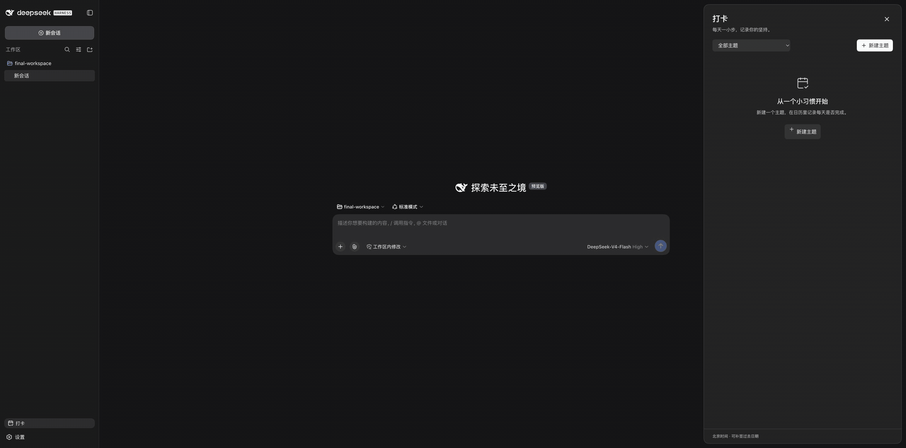
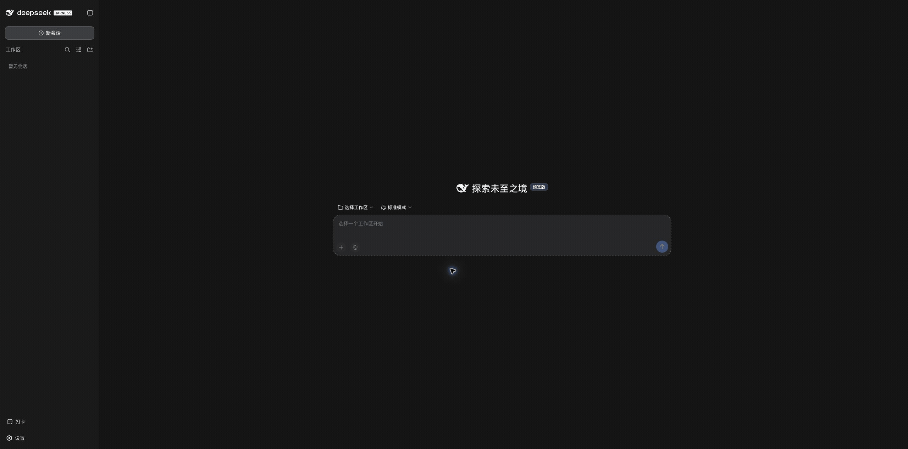

# 验证记录

验收日期：2026-09-10（北京时间）。验证代码提交：`bb9e46c3b2b42224d7d45e12f897e3450695ccc2`。文档与媒体在后续提交附加，运行代码未改变。

## 安装与环境

在干净提交上执行 `pnpm run build`，确认 `lib/` 与提交内容一致，再执行 `pnpm pack`。使用发布版 DSH `0.1.5-alpha.1` 和 Node `v24.13.0`，通过 `dsh plugin --profile web add <tarball>` 安装；已核对安装后的 Host、tools、client 与生成 Remote 文件 SHA-256 和提交产物一致。

正式运行位于本仓库忽略的 `.verification/` 下，使用全新的 `final-home`、`final-agents`、`final-workspace`，由 `dsh --profile web` 启动，origin 为 `http://127.0.0.1:39878`。全部 GIF 帧来自同一工作区、会话和数据目录；中间有一次用于持久化验收的正常 Host 停止及重启。

浏览器使用现有 Chrome profile 的专用新 origin 与新标签页，未使用全新 Chrome profile。录制页面截图尺寸为 2560×1267；另验证 390×844 窄屏，页面宽度与滚动宽度均为 390。验收使用 DSH 自带的 browser directory-picker 替换原生目录选择器。真实模型通过现有 credential provider 访问 DeepSeek-V4-Flash（High），没有复制或发布凭据。

## 真实模型与 UI 场景

两个真实模型回合共 12 步、13 次工具调用；Session 日志中有对应的 13 条 `tool/call` 和 13 条 `tool/result`。全部六种插件工具均被调用：create 3 次、list 2 次、update 1 次、delete 1 次、set 3 次、query 3 次。

| 场景 | 结果 |
| --- | --- |
| 空数据库打开侧栏打卡入口 | 展示空状态与新建入口 |
| 对话创建阅读、运动，完成今天阅读、补签昨天运动并查询 | 月历显示两个主题及对应日期完成数 |
| UI 完成今天运动、补签昨天阅读 | 总览即时更新为 2/2 |
| 单主题筛选、前后月份、回到今天 | 显示对应主题状态和月份 |
| 查看未来日期 | 可以选中；完成操作禁用 |
| 新建同名主题失败后改名重试 | 提示同名错误，输入保留，修改后成功 |
| UI 创建、重命名并完成饮水主题，再确认删除 | 主题及完成记录删除，总览分母恢复为 2 |
| 刷新浏览器、重新打开抽屉 | 主题和打卡状态恢复 |
| 对话撤销昨天阅读、运动改名锻炼、创建并删除临时主题、查询 | 抽屉在打开状态自动读取变化；撤销与改名保留正确历史 |
| 正常停止及重启 Host | 断连提示后恢复；数据库前后快照完全一致 |
| 390px 窄屏 | 抽屉铺满视口，未发现横向溢出 |

重启后的有效主题为「阅读」「锻炼」，共三条完成记录：锻炼 2026-09-09、锻炼 2026-09-10、阅读 2026-09-10。昨天阅读的撤销状态和已删除主题均未恢复。

## 演示记录

以下 GIF 由同一次真实运行的 25 张页面截图顺序编码，每张停留 2 秒，总长 50 秒（2560×1268，约 2.2 MB）。它是截图序列演示，不是连续视频，也不表示模型响应速度。画面包括请求、模型执行及结果、UI 操作、刷新和 Host 重启恢复。

[桌面截图](media/desktop.png) · [窄屏截图](media/mobile.png) · [脱敏工具调用及持久化证据](evidence.json)

## 自动化

`pnpm run check` 已通过构建、Host/Client/测试类型检查、lint、14 项测试和 tarball 内容检查。覆盖真实 SQLite 持久化、主题 CRUD、打卡幂等和撤销、级联删除、日期校验、未来日期拒绝、北京时间午夜、闰年与跨月、数据库重开、更高 schema 拒绝、请求竞态、UI 失败保留输入与键盘焦点恢复。

工具输出快照是无 API key 的确定性工具回放，与上述真实模型验收分别提供证据。验收范围是实际安装后的 DSH Web profile；没有验证原生桌面应用或原生目录选择器。数据库、原始会话、认证信息与运行目录均未纳入版本控制。

## 样式调整复验（2026-09-10）

本地样式修订对齐 Settings 入口的 42px 高度与 14px 字号，为原生主题筛选增加 Lucide 箭头，并限定空状态插画的间距，消除按钮内加号的垂直偏移。`pnpm run check` 通过全部 14 项测试。重新打包后安装至独立 `style-home` Web profile（39879），实际验证侧栏入口、空状态新建与主题筛选；DOM 测量确认两个入口尺寸一致，按钮图标下边距为 0。本次仅验证样式和手动操作，没有重复模型回合。

